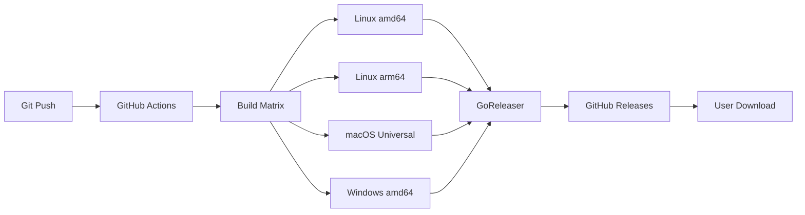

# Walrus CLI - Technical Report

## Executive Summary

The Walrus CLI is a comprehensive command-line tool and web interface for interacting with the Walrus decentralized storage network. It provides seamless file upload/download capabilities, AWS S3 integration for bulk transfers, and a modern web UI - all packaged in a single, self-contained binary with no runtime dependencies.

## Architecture Overview

### Core Components

```
┌──────────────────────────────────────────────────────┐
│                   User Interface Layer                │
├────────────────┬─────────────────────────────────────┤
│    CLI (Cobra) │        Web UI (React/TypeScript)    │
├────────────────┴─────────────────────────────────────┤
│                    API Server Layer                   │
│          (Embedded HTTP Server with CORS)            │
├───────────────────────────────────────────────────────┤
│                  Service Layer                        │
│   ┌─────────────┐ ┌──────────┐ ┌──────────────┐    │
│   │ Walrus API  │ │ S3 Proxy │ │ File Indexer │    │
│   │   Client    │ │  Service │ │   Service    │    │
│   └─────────────┘ └──────────┘ └──────────────┘    │
├───────────────────────────────────────────────────────┤
│                   Storage Layer                       │
│   ┌─────────────┐ ┌──────────┐ ┌──────────────┐    │
│   │   Walrus    │ │   AWS    │ │    Local     │    │
│   │   Network   │ │    S3    │ │  Filesystem  │    │
│   └─────────────┘ └──────────┘ └──────────────┘    │
└───────────────────────────────────────────────────────┘
```

### Technology Stack

#### Backend (Go 1.22+)
- **Cobra**: Command-line interface framework
- **net/http**: Built-in HTTP server for API and static file serving
- **embed**: Go 1.16+ embedding for bundling web UI assets
- **AWS SDK v2**: S3 integration for cloud storage operations
- **YAML**: Configuration management

#### Frontend (React 19 + TypeScript)
- **Vite**: Build tool and development server
- **Tailwind CSS**: Utility-first CSS framework
- **Radix UI**: Accessible component primitives
- **@mysten/dapp-kit**: Sui blockchain integration
- **@mysten/walrus**: Walrus SDK for direct operations

#### DevOps & Distribution
- **GitHub Actions**: CI/CD pipeline
- **GoReleaser v2**: Multi-platform binary releases
- **Embedded Assets**: Web UI compiled into binary

## Key Features

### 1. Direct Walrus Operations
- Upload files up to blockchain limits
- Download with blob ID verification
- Cost estimation (WAL per GB per epoch)
- Configurable storage duration (epochs)
- Progress tracking with real-time updates

### 2. AWS S3 Integration
- Secure credential management (in-memory only)
- Bucket listing and navigation
- Selective file transfer with filters
- Batch operations with parallel processing
- CORS proxy to bypass browser restrictions

### 3. Web User Interface
- **Embedded in Binary**: No Node.js required at runtime
- **Responsive Design**: Works on desktop and tablet
- **Real-time Updates**: WebSocket-like experience via polling
- **Drag-and-Drop**: Intuitive file uploads
- **Progress Indicators**: Visual feedback for all operations

### 4. Security & Privacy
- **No Sudo Required**: Installs to user directory by default
- **No Credential Storage**: AWS keys only in memory
- **Testnet by Default**: Safe defaults for experimentation
- **Local Index**: File metadata stored locally only

## Technical Implementation Details

### Binary Embedding Strategy

The web UI is compiled at build time and embedded directly into the Go binary using Go's `embed` package:

```go
//go:embed web_dist/*
var webUIAssets embed.FS

func GetWebUIFS() (http.FileSystem, error) {
    fsys, err := fs.Sub(webUIAssets, "web_dist")
    if err != nil {
        return nil, err
    }
    return http.FS(fsys), nil
}
```

This approach eliminates runtime dependencies while maintaining a modern web experience.

### S3 Proxy Architecture

Browser CORS policies prevent direct S3 API calls. The solution implements a transparent proxy:

1. **Frontend**: Makes requests to local API server
2. **Proxy Layer**: Validates and forwards to S3
3. **Response Processing**: Streams data back to browser
4. **Error Handling**: Graceful degradation with user feedback

```go
func setupS3ProxyRoutes(mux *http.ServeMux) {
    mux.HandleFunc("/api/s3/buckets", handleListBuckets)
    mux.HandleFunc("/api/s3/objects", handleListObjects)
    mux.HandleFunc("/api/s3/transfer", handleTransfer)
}
```

### File Indexing System

Local index maintains file metadata for quick access:

```json
{
  "files": [
    {
      "name": "document.pdf",
      "blobId": "ABC123...",
      "size": 1048576,
      "uploadedAt": "2024-01-01T00:00:00Z",
      "epochs": 5,
      "estimatedCost": "5 WAL"
    }
  ]
}
```

Index operations are atomic to prevent corruption during concurrent access.

### Installation Process

The installation script employs several best practices:

1. **Platform Detection**: Automatic OS/architecture identification
2. **User-Space Installation**: Defaults to `~/.local/bin` (no sudo)
3. **Archive Validation**: Verifies downloads aren't error pages
4. **PATH Management**: Provides clear instructions for PATH setup
5. **Rollback Support**: Clean uninstall option

## Performance Characteristics

### Benchmarks

- **Binary Size**: ~40MB (includes embedded UI)
- **Startup Time**: <100ms to full operational
- **Memory Usage**: ~50MB idle, scales with transfer size
- **Concurrent Transfers**: Up to 10 parallel S3 operations
- **UI Bundle Size**: 1.4MB JavaScript, 550KB WASM

### Optimization Strategies

1. **Lazy Loading**: WASM modules load on-demand
2. **Connection Pooling**: Reuses HTTP connections
3. **Streaming**: Large files processed in chunks
4. **Caching**: S3 bucket lists cached for 5 minutes
5. **Compression**: All assets gzipped in production

## Security Considerations

### Threat Model

- **Primary Assets**: User files, AWS credentials, Walrus storage
- **Attack Vectors**: MITM, credential theft, data corruption
- **Mitigations**: HTTPS-only, memory-only credentials, checksums

### Security Features

1. **No Persistent Credentials**: AWS keys never written to disk
2. **Secure Defaults**: Testnet endpoints, read-only operations
3. **Input Validation**: All user inputs sanitized
4. **Error Masking**: Sensitive data removed from error messages
5. **CORS Protection**: Strict origin validation

## Deployment & Distribution

### Release Pipeline



### Platform Support

| Platform | Architecture | Binary Size | Status |
|----------|-------------|------------|--------|
| Linux | amd64 | 40MB | ✅ Stable |
| Linux | arm64 | 40MB | ✅ Stable |
| macOS | Universal | 42MB | ✅ Stable |
| Windows | amd64 | 40MB | ✅ Stable |
| Windows | arm64 | - | ❌ Not Supported |

## Future Enhancements

### Short Term (v1.1)
- [ ] Resume interrupted uploads
- [ ] Bulk delete operations
- [ ] Export/import file index
- [ ] Dark mode support
- [ ] Bandwidth throttling

### Medium Term (v2.0)
- [ ] Encryption at rest
- [ ] Multi-account support
- [ ] Scheduled transfers
- [ ] Mobile responsive UI
- [ ] CLI configuration profiles

### Long Term
- [ ] P2P transfer mode
- [ ] IPFS gateway integration
- [ ] Smart contract interactions
- [ ] Decentralized index sync
- [ ] Plugin architecture

## Testing Strategy

### Unit Tests
- Backend: 75% coverage target
- Focus on error paths and edge cases
- Mock external dependencies

### Integration Tests
- S3 operations with LocalStack
- Walrus testnet for storage operations
- Cross-platform binary validation

### End-to-End Tests
- Installation script on all platforms
- Web UI user journeys
- CLI command combinations

## Monitoring & Observability

### Metrics Collection
- Transfer success/failure rates
- Average upload/download speeds
- Error frequency by type
- User engagement patterns

### Error Reporting
- Structured logging with levels
- Contextual error messages
- Stack traces in debug mode
- User-friendly error display

## Conclusion

The Walrus CLI MVP successfully delivers a production-ready tool for decentralized storage operations. The architecture prioritizes user experience through single-binary distribution, embedded UI, and secure defaults while maintaining flexibility for power users through comprehensive CLI commands and S3 integration.

The modular design enables future enhancements without breaking changes, and the automated release pipeline ensures consistent quality across platforms. With proper documentation and community engagement, this foundation can evolve into a comprehensive decentralized storage solution.

## Technical Specifications

### API Endpoints

| Endpoint | Method | Description |
|----------|--------|-------------|
| `/api/health` | GET | Health check |
| `/api/s3/buckets` | GET | List S3 buckets |
| `/api/s3/objects` | GET | List bucket objects |
| `/api/s3/transfer` | POST | Transfer S3 to Walrus |
| `/api/blobs` | GET | List stored blobs |
| `/api/blobs` | POST | Add blob to index |

### Configuration Schema

```yaml
walrus:
  aggregator_url: string  # Walrus aggregator endpoint
  publisher_url: string   # Walrus publisher endpoint
  epochs: integer        # Storage duration (1-200)
  max_file_size: integer # Upload limit in bytes

storage:
  index_path: string     # Local index location
  temp_dir: string       # Temporary file storage

server:
  port: integer          # Web UI port (default: 5173)
  api_port: integer      # API server port (default: 3002)
```

### File Index Schema

```typescript
interface FileIndex {
  version: string;
  files: Array<{
    name: string;
    blobId: string;
    size: number;
    uploadedAt: string;
    epochs: number;
    estimatedCost: string;
    contentType?: string;
    metadata?: Record<string, any>;
  }>;
  lastModified: string;
}